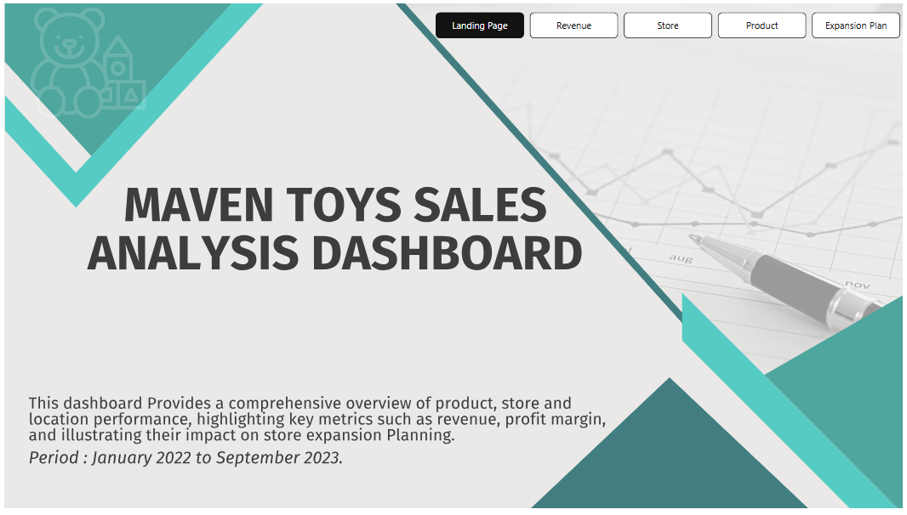
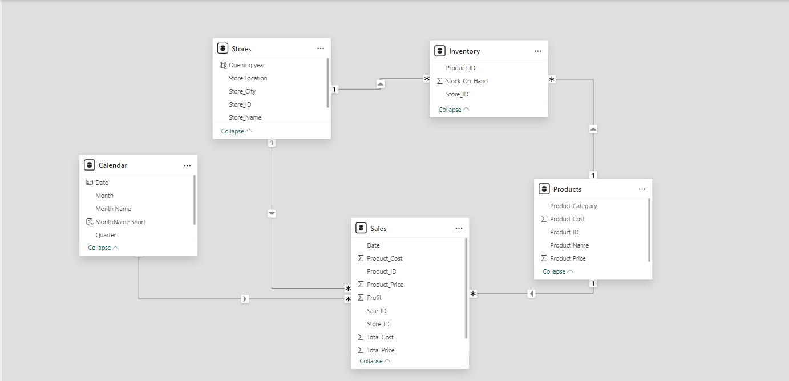
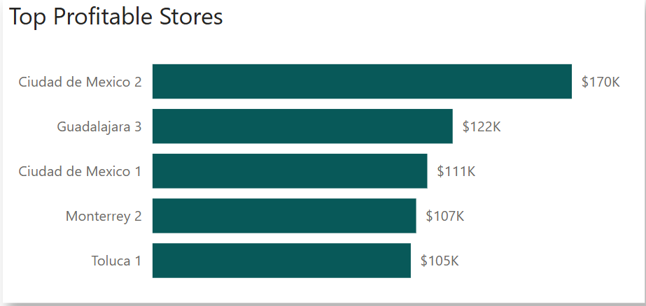
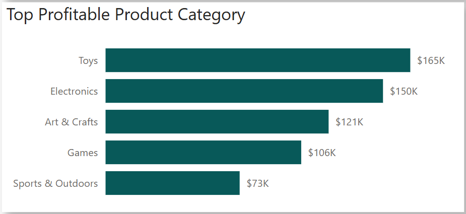
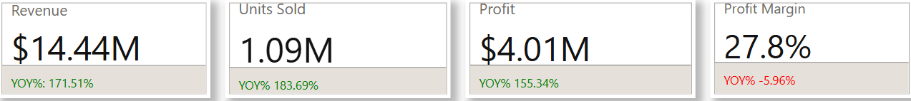
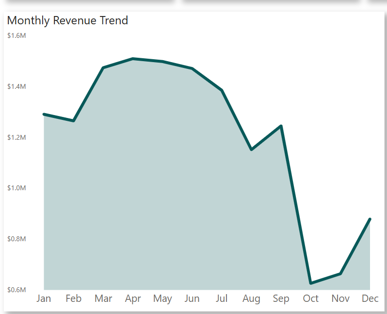
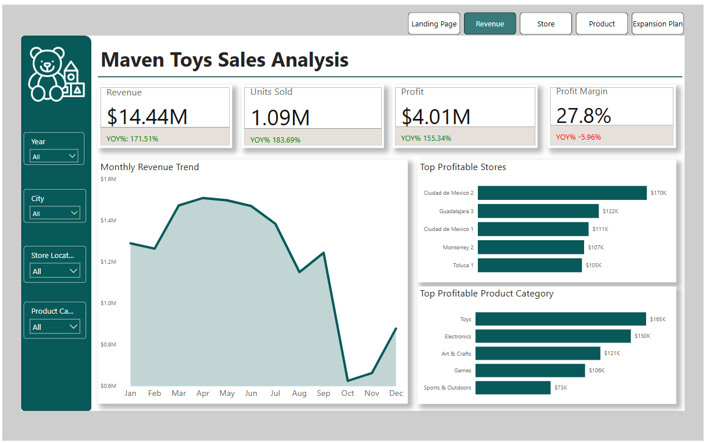
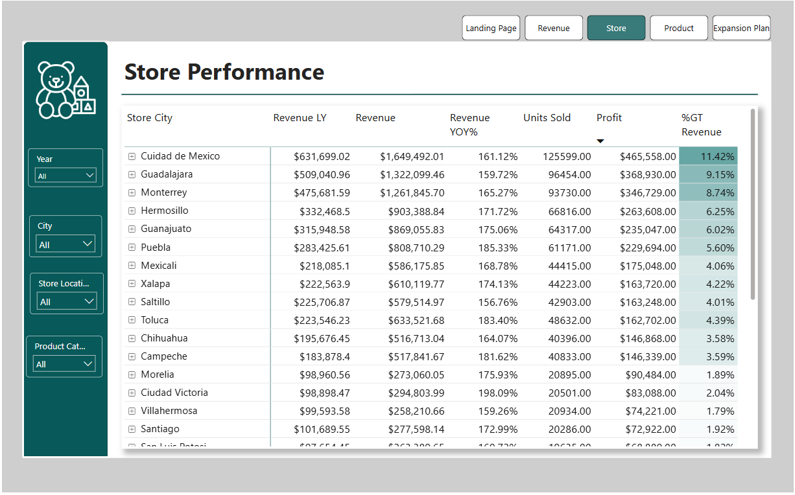
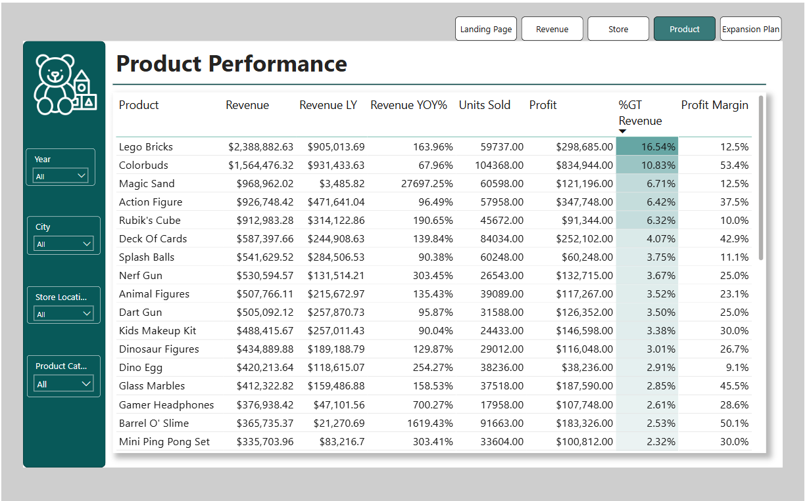
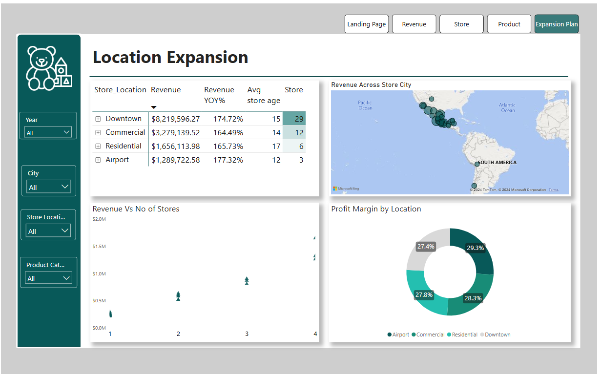

# Maven-Toys-Sales-Analysis

## Introduction:
In this project, I will be assuming the role of a BI consultant who has just been hired by this fictional company ***“Maven Toys”***. As they look to expand their business with new stores, they’ve brought me in to analyze interesting patterns and trends in their data and help them make informed decisions.

## Overview:
We have been provided with sales and inventory data with over 800,000 sales transactions from January 2022 to September 2023 for a chain of toys stores in Mexico called Maven Toys store. Maven store has been in existence since 1992 till date (over 30 years of establishment.

## Problem statement/Objective:
Maven Toys’ major objective is to expand their business with new stores. Based on historical data from January 2022 to September 2023, they have posed the following business questions to help them make an informed decision.
- Your task is to build a visualization or dashboard.
- Which product category drives the biggest profits? Is this the same across store locations?
- What is our Year-over-year (YOY) revenue and profit growth? 
- Can you find any seasonal trends or patterns in the sales data?
- Expansion plan and contains supporting data from your analysis.
- How would you advise Maven Toys to proceed with their expansion based on the insights you’ve garnered?

## Skills Demonstrated:
The following Powerbi features were Incorporated.
- DAX
- Quick Measures
- Measures
- Calculated column
-	Page Navigation and Bookmarking
- Filters
- Tooltips

## Data Sourcing
The dataset was provided by Tina Analytics for Maven Toys Sales Report.
This dataset contains 4 tables, in CSV format:
- The Products table contains the 35 products sold at Maven Toys (each record represents
one product), with fields containing details about the product category, cost, and retail price

- The Stores table contains the 50 Maven Toys store locations (each record represents one
store), with fields containing details about the store location, type, and date it opened
- The Sales table contains the units sold in over 800,000 sales transactions from January
2022 to September 2023(each record represents the purchase of a specific product at a specific
store on a specific date)
- The Inventory table contains over 1,500 records that represent the stock on hand of each
- product in each store at the current point in time(September 30th,2023)

## Data Preparation:
The Dataset provided was in a CSV Format embedded in a zip file. The data was first extracted, Transformed and cleaned thoroughly by utilizing the Data-transformation capabilities of Power Query, before loading into Powerbi. The data was examine for inconsistence, errors, null values, incorrect data type, spelling errors and maintain the integrity of the information, ensuring reliable insights and informed decision-making.
### Data profiling and cleaning
Data profiling is crucial as it provides a comprehensive understanding of the quality, structure, and relationships within a dataset, ensuring that potential issues are identified early on. Cleaning the data is equally vital to enhance accuracy, eliminate inconsistencies, 
## Data Model:

Data modeling is essential in Power BI analysis, as it transforms raw data into a structured framework, establishing relationships and hierarchies that are key to meaningful visualizations. Related tables were connected to creating an optimized star schema model that serves as the foundation for insightful analysis.
The data model is a star schema. The cardinality is one - many as shown in the model.

## Analysis and Visualization.
### EXPLORATORY ANALYSIS
- Total Revenue: $14.44M
- Total Unit Sold: 1.09M
- Total Profit: $4.01M
- Total Profit Margin: 27.79%
- Total Stock: 30K
## DAX.
- To propagate my analysis I created several measures and new columns to aid the process.
### Base Measures
- `Profit = SUM(Sales[Profit])`
- `Revenue = SUM(Sales[Total Price])`
- `Units Sold = SUM(Sales[Units])`
- `Profit Margin = DIVIDE([Profit],[Revenue])`

### Variance Measures
- `Profit YOY% = DIVIDE(([Profit]-[Profit LY]),[Profit LY])`
- `Revenue YOY% = DIVIDE(([Revenue]-[Revenue LY]),[Revenue LY])`
- `Units Sold YOY% = DIVIDE(([Units Sold]-[Units Sold LY]),[Units Sold LY])`
- `Revenue LY = CALCULATE([Revenue],SAMEPERIODLASTYEAR('Calendar'[Date]))`
- `Profit LY = CALCULATE([Profit],SAMEPERIODLASTYEAR('Calendar'[Date]))`
- `Units Sold LY = CALCULATE([Units Sold],SAMEPERIODLASTYEAR('Calendar'[Date]))`
- `Profit Margin = DIVIDE([Profit],[Revenue])`
- `Profit Margin LY = CALCULATE([Profit Margin],SAMEPERIODLASTYEAR('Calendar'[Date]))`
- `Profit Margin YOY% = DIVIDE(([Profit Margin]-[Profit Margin LY]),[Profit Margin LY]`
- `Store Age:DATEDIFF`

### KEY QUESTION 
**1. Top 5 Profitable Stores**

- The top profitable Stores are:
•	Ciudad De Mexico 3 : $94K
•	Puebla 3: $79
•	Hermosillo 1: $77
•	Monterrey 1: $74
•	Guadalajara: $69K

**2. Top Profit table Products**

Top Profitable Product Categories Are;
1. Toys: $112K
2. Electronics: $94K
3. Arts & crafts: $80K

- .1What is our Year-over-year (YOY) revenue and profit growth

A YOY comparison is an effective way to evaluate the financial performance of Maven Toys by comparing the revenue and profit for the same period in the current year with the same period in the previous year. The time  period here is 2022 to 2023.

**3. Seasonal and monthly Trends:**

---
There are clear seasonal and monthly trends in Maven Toys' revenue:
### Seasonal Trend:
Insights
1.	Winter Dominance: Winter generates the highest revenue, driven by holiday shopping and festive gifts.
2.	Spring Demand: Spring follows closely, indicating strong demand likely due to seasonal breaks and warmer weather.
3.	Fall Stability: Fall brings in stable revenue, suggesting steady demand possibly linked to back-to-school or pre-holiday purchases.
4.	Summer Dip: Summer has the lowest revenue, indicating a potential slowdown in toy purchases during this summer vacation.

### Insights Summary
Maven Toys experiences peak sales in winter and spring, driven by holiday shopping and seasonal breaks, respectively. Fall brings stable revenue linked to back-to-school and early holiday purchases, while summer shows the lowest sales, suggesting reduced demand. These insights indicate a need for increased inventory and targeted marketing in winter and spring, steady campaigns in fall, and creative promotions in summer to balance sales and optimize resources year-round.

### monthly Trend
Maven Toys’ revenue peaks in December driven by holiday shopping, with additional high sales in April and May, likely from spring-related purchases. Sales are steady from January to March and increase in fall (September–November) due to back-to-school and early holiday shopping. The summer months (June–August) see the lowest revenue, indicating a seasonal slowdown that may benefit from targeted promotions. 

### Recommendations
1.	Increase Inventory in Winter and Spring: Plan for high stock levels to capture peak demand, especially around the holidays in winter and seasonal breaks in spring.
2.	Launch Targeted Promotions: In winter, emphasize holiday gift sets, while in spring, highlight outdoor toys and seasonal products. Use discounts or bundles in fall to encourage pre-holiday purchasing.
3.	Boost Summer Demand: Implement promotions, summer-exclusive products, or events to draw customers and encourage purchases during the low season.
4.	Optimize Fall Campaigns: Focus on back-to-school promotions and early holiday preparations to ensure steady sales in the lead-up to winter.
This approach maximizes sales during peak seasons, maintains stability in fall, and addresses lower revenue in summer to support year-round growth.

## Visuals
There are 5 Pages; the first page is the same as the landing page above.

**Revenue Page**

---
**Store Performance**

---

**Product Performance**

---
**Location expansion**

---

### Expansion plan.
Proposed Expansion Strategy:
Based on these findings, the expansion strategy could focus on:
- High-Margin, Low-Presence Areas: Expand in airports and residential areas to capture high-margin sales with minimal competition.
-	Sustained Growth in Commercial Zones: Add a limited number of stores in select commercial areas to balance growth without oversaturating.
-	Controlled Growth in Downtown: Limit further expansion downtown, focus on enhancing operational efficiency and customer experience in existing locations.

**Insights**
1.	Airport Locations
- Profit Margin: 29.31% (highest among all locations)
- Current Presence: 3 stores with an average age of 12 years (youngest)
- Insight: Airport stores are highly profitable and relatively new, indicating strong performance and room for expansion in other high-traffic terminals.
2.	Commercial Areas
-	Profit Margin: 28.3%
-	Current Presence: 12 stores with an average age of 14 years
-	Insight: Commercial zones show solid profitability and a moderate store presence. Their age suggests consistent demand, making these locations promising for additional stores in busy shopping districts.
3.	Residential Areas
-	Profit Margin: 27.8%
-	Current Presence: 6 stores with the oldest average age of 17 years
-	Insight: Residential stores have sustained demand over time. The low number of stores, despite strong profit margins, suggests opportunities to expand into family-friendly neighborhoods.
4.	Downtown Areas
-	Profit Margin: 27.4%
-	Current Presence: 29 stores with an average age of 15 years
-	Insight: Downtown locations are well-established with the largest store count and slightly lower margins, indicating potential market saturation. Future focus should be on improving operations rather than further expansion.

### Expansion Plan
1.	Airport: Expand by adding 3 new stores in other high-traffic airport locations to capitalize on the highest profit margins and low saturation.
2.	Commercial: Add 6 stores in strategic, high-traffic shopping areas within commercial zones to capture increased demand and strengthen presence in profitable areas.
3.	Residential: Add 3 stores in family-oriented neighborhoods to serve established demand and support recurring local purchases.
4.	Downtown: Refrain from adding new stores due to market saturation. Focus on enhancing operational efficiency and customer experience in existing locations.
This expansion plan prioritizes profitable, less saturated areas while optimizing resources in mature markets.
This expansion strategy prioritizes high-profit, low-competition areas while managing market saturation in existing locations.

### Conclusion and Recommendations
1.	Increase Inventory in Winter and Spring: Plan for high stock levels to capture peak demand, especially around the holidays in winter and seasonal breaks in spring.
2.	Launch Targeted Promotions: In winter, emphasize holiday gift sets, while in spring, highlight outdoor toys and seasonal products. Use discounts or bundles in fall to encourage pre-holiday purchasing.
3.	Boost Summer Demand: Implement promotions, summer-exclusive products, or events to draw customers and encourage purchases during the low season.
4.	Optimize Fall Campaigns: Focus on back-to-school promotions and early holiday preparations to ensure steady sales in the lead-up to winter.
This approach maximizes sales during peak seasons, maintains stability in fall, and addresses lower revenue in summer to support year-round growth.

---

